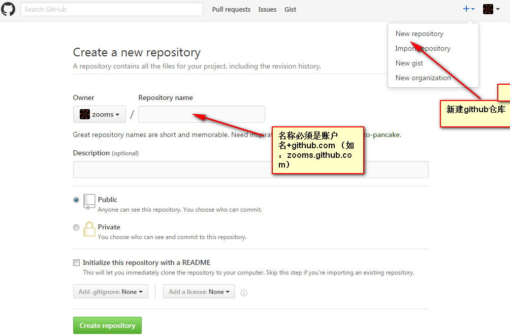

# github构建个人网站    
**个人学习记录**
## 1.github帐号 
>github.com注册/登录 

## 2.github项目  
>点击 + 号 -> New repository ->该填的填了 点击Create repository创建成功 
>     
>    打开刚创建的项目新建 `index.html` 进行测试 
  
        <!DOCTYPE html>
		<html lang="en">
		<head>
		    <meta charset="UTF-8">
		    <title>hello world</title>
		</head>
		<body>
		    <h1>Hello World !</h1>
		</body>
		</html>

输入网址项目名+.github.io 测试（如：`zooms.github.io`）  
*个人网站创建到此结束，下方是使用git或者svn更新到本地进行编辑和提交* 

## 3.同步到本地   
>打开仓库点击右上角绿色的Clone or download按钮  
>复制网址
>用svn或者git更新后可进行编辑  

## 4.上传修改 
>编辑修改后用svn或者git进行提交
>注：提交过程中可能需要输入github的帐号和密码  

*详情见<a href="https://github.com/zooms/zooms.github.com/blob/master/md/github_page介绍.md"> github个人网站</a>*
